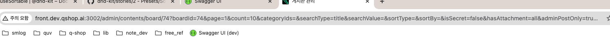
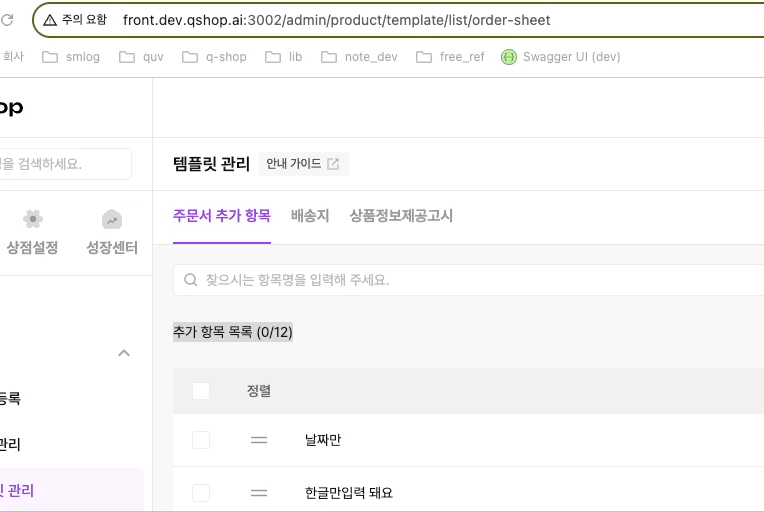

<p>
    
    
    
</p>

### 관련문서

- [Next rouing]

<h1 style="color:#4caf50;font-weight:500;">Catch-all Segments</h1>

관리자 페이지에서 가장 흔한 요청사항   
리스트 페이지에서 검색 필터를 유지 시키는 것 (새로고침 + 뒤로기가기 등)  

일하면서 적용했던 방법과 개선사항을 기록 해봄

### 검색결과를 유지했던 방법
- `next route` 와 `react hook form` 으로 `query string` 관리
- `query string` 변경시 `react query` 로 Fetching

### useList Hook
- router query 값을 react-query 의존성 연결
- query 값 기본으로 data fetch
  
```jsx
    const useList = () => {
        const {query, push, pathname} = useRouter()

        const parseQueryParams = query => ({
            page: Number(query.page) || 1,
            count: Number(query.count) || 10,
            /** query string... */
        })

        const queryParams = useMemo(() => parseQueryParams(query), [query])

        const { data, isLoading } = useQuery(['query-key', queryParams], () => getData(queryParams), {
            keepPreviousData: true,
        })
    }
```

- parse 한 query 값은 react-hook-form 으로 값 관리

```jsx
    const useList = () => {
        const form = useForm({ defaultValues: queryParams })
        const { control, reset } = form
        const [page, count] = useWatch({ control, name: ['page', 'count'] })
    }
```

### List Component
- `useList()` 활용 리스트 조회
- 검색 + 페이징은 `router push` 로 query 값 변경

```jsx
    const List = () => {
        const {form , list, page, count, ...} = useList()

        return (
            <Page>
                <FormProvider {...form}>
                    <input type='search'   />

                    <Table>
                        {list?.map(el => <Content key={el.id} {...el} />)}
                    </Table>
                </FormProvider>
            </Page>
        )
    }
```

### 길어도 너무 긴 url
{: .mb-lg-4 }


### 개선 방향
- query key value 네이밍을 짧게 해보기?   
  -  필터 값이 많을수록 무의미   
  -  key value 정확한 네이밍으로 또 convert 해줘야 함
-  `local storage` 숨기기? 
   -  검색 url 을 공유해서 들어가는 경우 제대로 작동 안됨
- 고민하다 [next.js 다이나믹 라우팅] 기술중인 하나인 `Catch-all Segments` `Optional Catch-all Segments` 사용하기로

### 페이지 구조
```text
  - template
    - list 
        - [[...slug]].jsx
    - [id].jsx : 상세페이지 + 수정페이지
    - create.jsx : 등록페이지
```

### useList Hook 개선
- 기존 검색필터 유지 방향은 동일 다만 query 가 아닌 path 로 필터 유지
  ```jsx
    const {
        push,
        query: { slug },
    } = useRouter()

    const resetForm = (slug = []) => {
        const [_, page = 1, count = 10, searchWord = ''] = slug
        reset({ page: Number(page), count: Number(count), searchWord })
    }

    ...

    useEffect(() => {
        if (slug) resetForm(slug)
    }, [slug])
  ```

- 검색 + 페이징 router 이동할때 query string 을 붙이지 않고 경로로 입력
  - `/template/list/${page}/${count}/${keyword}`
  - 기존 query key 값을 생략, value 값을 path 넣어줌
  - 미리 약속된 순서가 필요 (path 순서)
  ```jsx
    const handlePage = page => {
        push(`/product/template/list/order-sheet/${page}/${count}`)
    }

    const handleCount = count => {
        push(`/product/template/list/order-sheet/1/${count}`)
    }

    const search = ({ count, searchWord }) => {
        push(`/product/template/list/order-sheet/1/${count}/${searchWord}`)
    }
  ```

### 보기 좋아진 url
{: .mb-lg-4 }



[Next rouing]: https://nextjs.org/docs/app/building-your-application/routing/dynamic-routes#catch-all-segments
[next.js 다이나믹 라우팅]: https://nextjs.org/docs/app/building-your-application/routing/dynamic-routes#catch-all-segments
