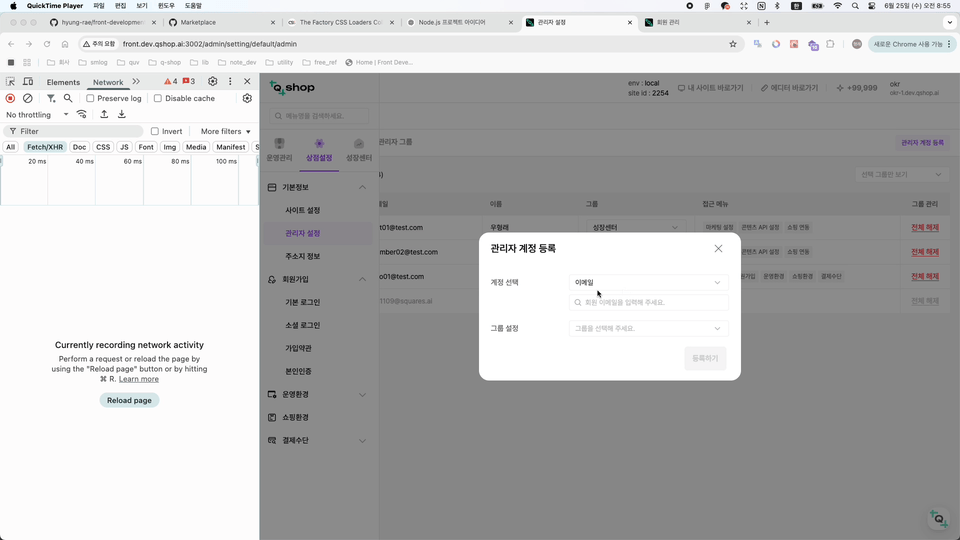

<p>
    
    
</p>

### 관련문서

- [useInfiniteQuery docs]

<h1 style="color:#0c0c0c;font-weight:500;">useInfiniteQuery 무한스크롤</h1>

`useInfiniteQuery` 훅을 사용전에는 `useQuery` 훅에서 `onSuccess` callback 을 활용해 무한스크롤을 구현 했다.   
코드 가독성과 모듈화가 좋지 않았고 만들어야하는 함수들이 너무 많아 개선이 필요했다.

`react query` 버전 이슈로 혜매였지만 다행히 큰 이슈는 아니여서 금방 해결했다. (latest version 의 중요성...)


### 구현 모습
{: .mb-lg-4 }


### useInfiniteQuery hook

- `react query` v3 에서는 `data.pageParams` 의 첫번째 값은 `undefined` 이므로 당황 하지 말기   
- `v5` 부터에는 hook option 에 `initialPageParam` 이라는 옵션으로 초기값을 설정할 수 있음
- `getMembers` fetch 함수에서도 볼수 있듯 `currentPage flag` 를 하나 추가해줘야 함
- `pageParam` 페이지를 구분하기 위한 값 
- `getNextPageParam` 
  - 다음 페이지를 구분하기 위한 값
  - 여기서 다음 fetch를 할지 결정 
  - `lastPage` : 마지막 호출한 `api return data`
  - `allPages` : 여태까지 호출한 `data array`

```jsx
/** useMemberSearch custom hook 내부 로직 */

export const getMembers = async params => {
  const { data } = await apiInstance.get('/members', {
    params: { ...params, status: 'normal', count: 10 },
  })

  return {
    ...data,
    currentPage: params.page,
  }
}

const { data, fetchNextPage, hasNextPage } = useInfiniteQuery(
        ['memberList', searchType, searchWord],
        ({ pageParam = 1 }) => getMembers({ page: pageParam, searchType, searchWord }),
        {
          getNextPageParam: (lastPage, allPages) => {
            const totalCount = lastPage.count
            const count = allPages.reduce((acc, cur) => acc + cur.list.length, 0)
            return count < totalCount ? lastPage.currentPage + 1 : undefined
          },
          enabled: !!searchWord,
        }
    )

``` 

### Component 에서 사용

```jsx
    const { data, fetchNextPage, hasNextPage } = useMemberSearch()

    ...

    return (
        <SelectOptions
            options={data?.pages?.map(page => page.list).flat()}
            callback={hasNextPage ? fetchNextPage : null} 
        />
    )
```


[useInfiniteQuery docs]: https://tanstack.com/query/v3/docs/framework/react/guides/infinite-queries