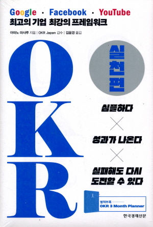

OKR이 단순한 목표 관리 도구가 아니라 팀의 방향성을 명확히 하고 성과를 극대화하는 프레임워크라는 걸 깨달았다.

OKR에서 목표(Objective)는 정성적이며 가슴 뛰는 것이어야 하고, 이를 달성하기 위한 핵심 결과(Key Results)는 명확하고 정량적이어야 한다.

이렇게 설정된 목표가 팀 전체를 하나로 집중시키고, 각자의 역할을 명확하게 정렬시켜 모두가 같은 방향으로 나아가는 데 중요한 역할을 한다는 것도 다시 한번 느꼈다.

책을 읽으면서 가장 인상 깊었던 부분은 OKR이 도전적이고 공격적인 목표 설정에 적합하며, 실패를 허용하는 환경이야말로 더 큰 성과와 혁신을 이끌어낸다는 내용이었다.

안전망이 있을 때 더 높은 목표에 도전할 수 있고, 새로운 아이디어도 쉽게 나올 수 있다고 한다.

OKR을 하는 이유는 결국 **“실패를 두려워하지 말고 더 큰 도전을 추구하기 위해서”**라는 걸 마음에 새기기로 했다.

또한 팀의 미션을 설정할 때 내부적인 목표뿐만 아니라 외부에 미칠 영향까지 고려하는 것이 중요하다는 점도 알게 되었다.

앞으로 OKR을 실천할 때 단순한 성과 수치가 아니라 진정한 가치를 담을 수 있는 목표를 설정하는 데 집중할 것이다.

그리고 OKR을 통해 팀의 도전을 인정받고, 함께 성장하는 경험을 쌓아갈 것이다.
