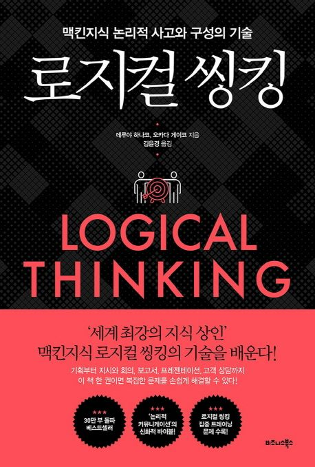

<h3 style="color:#0c0c0c;font-weight:500;">회의가 끝나고 담탐을 가졌던 이유들</h3>

- 일단 먼저 생각해야하는 것 3가지 전달하려는 주제 , 주제에 대한 답변 , 그래서 내가 원하는 반응
- 상대방을 만족시키는 답변을 하기위해서 결론, 근거, 방법 이 3가지 요소를 잘 준비해라
- 설득력 없는 답변의 이유 내용 중복, 누락, 혼재, 내용의 비약
- **부대조건**(**어떤 조건에 덧붙은 조건**)은 동상이몽의 원인이다. - 결론이 상대방에게 전달되지 않는 이유
- **공리**(증명할 필요가 없이 자명한 진리)는 사람을 움직이지 못한다. - 방법이 전달되지 않을 때의 두 가지 함정
- 이야기의 **누락**은 ‘한 점 돌파, 전면 붕괴’로 이어진다. -2장 설득력 없는 답볍에 공통된 결함

<h3 style="color:#0c0c0c;font-weight:500;">그니깐 교집합은 나쁜거죠?</h3>

- 전체 집합을 찾고 중복도 누락도 없는 부분 집합으로 나누는 방법 → MECE 사고방식
- 올바른 그룹핑으로 MECE 기준 찾기
- “그래서” 와 “근데 그게 왜” 를 올바르게 사용하는 방법
- 당신의 견해를 명확하게 제시해 상대가 이해할 수 있도록 하는 방법이 훨씬 현실적이지 않을까? -상대의 입장에서 설명해야한다는 주장의 반론
- 적합한 관점의 기준이 떠오르지 않았던 것이다. , MECE로 정리하는 것 부터 시작해보자 - MECE 연습문제를 열심히 풀어야겠다…
- 가장 이상적인 그룹핑은 **그것**과 **그것 이외,** 더 나아가서 그것 이외를 더 세밀하게 정리해야 한다.
- 관찰의 So What / Why So , 통찰의 So What / Why So
  - 가시적인 (정량적인?) 것으로 확인 할수 있는거면 관찰?
  - 결국 통찰에 결론은 관찰?

<h3 style="color:#0c0c0c;font-weight:500;">나무를 보지말고 숲을 봐라</h3>

- 잘만든 부품도 조립해야지 이게 뭔지 안다.
- 논리구성 = 세로는 So What / Why So , 가로는 MECE 로
- 아주 기깔나게 So What / Why So + MECE 하는게 목표가 아니다.
- so what / why so
  - 관찰의 so what / why so → 관찰 대상의 요약
  - 통찰의 so what / why so → 주어진 자료 , 정보에서 다른 요소를 추출함과 동시에 타당한지 검증하는 것
- 아주 멋들어지게 MECE 해봤자 결론이 너가 하고 싶은 말이면 의미가 없다. 일단 결론이 적합한지 확인하자
- so what / why so , MECE 의 늪에 빠지지 말기 목적은 상대에게 “전체상” 을 제시하는 것

<h3 style="color:#0c0c0c;font-weight:500;">논리구조는 그때그때 달라요</h3>

- 상대에게 어떻게 결론을 제시하는지 어떤 답을 구하는지에 따라 논리구조는 달라진다.
- 병렬형 구조는 한마디로 전체적인 내용을 간결하게 전달하고 싶을때
- 해설형 구조는 내 주관적인 사고를 MECE 하게 전달할때
- 방법이든 근거이든 아니면 판단기준이든 아무튼 모두 다 MECE 해야 한다.
- 결론은 상대에게 정확히 이해시킬 수 있는지 고려 해보자
- 해설형 논리구조 (사실 / 판단 기준 / 판단 내용)
  - 사실을 바탕으로 자신의 사고를 담은 판단 기준으로 판단 내용을 MECE 하게 전달하기
- 판단의 기준은 주관적이지만 그렇다고 너무 주관적이면 안되고 상대에게 충분한지도 고려 해라
  - 해설형 논리구조로 결론을 상대에게 제시할때

<h3 style="color:#0c0c0c;font-weight:500;">스토브리그 백승수 단장 ppt가 매번 성공하는 이유</h3>

- 두가지 결론을 무리하게 끼워 맞춰서 논리의 오류를 발생시키지 말자
- 두가지 논리 유형을 가로 방향으로 합하기
  1. 옳고 그름을 논의하지 않고 알맞은 대책을 세우자 → 병렬형 + 병렬형
  2. 탁상공론은 그만 구체적인 대책을 단적으로 제시 해보지 → 해설형 + 병렬형
  3. 결론은 합의 됨 논쟁여지 없어 이제 구체적적인 방법의 타당성을 설득 → 병렬형 + 해설형
  4. 처음부터 끝까지 차분히 내 이야기를 들어줄 분들 → 해설형 + 해설형
- 즉 이 모든건 과제가 몇개인지 명확해야 한다.
- 프레젠테이션을 할 때는 도입부를 제대로 만들어야 한다.
  - 커뮤니케이션의 목적을 확실히 제시하고 답변이라는 본 주제로 들어가자.
- 논리 구성을 할 때 항상 과제를 정확히 확인하기
  - 그래야 MECE 기준도 가늠할 수 있다.
