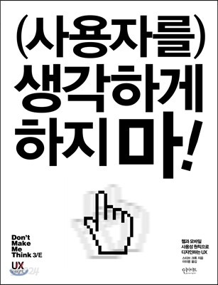

<h3 style="color:#0c0c0c;font-weight:500;">요약</h3>

- 책의 초판이 나온지도 오래되고 그동안 웹도 빠르게 발전 했지만 책에서 전하고자 하는 기본 원칙은 변하지 않았다.
- 최우선의 원칙은 사용자를 고민에 빠뜨리지 마라!
- 우리가 반드시 알아야 할 것은 실제 웹을 사용하는 사람은 우리가 상상했던 모습으로 사용하지 않는다.
- 훑어보기 좋은 디자인은 관례와 명료성을 잘 표현한 것
- 명료하기 위해선 웹페이지 소음을 줄이고 불필요한 단어를 덜어내라
- 망망대해에서 좋은 이정표를 만드는 방법
- 누구나 원한다. 그래서 모두의 취향에 두루 맞아야 한다.
- 탁상공론은 그만! 이제부터 평가해보자.
- 평가는 질보다 양
- 좁은 공간에서 사용성을 희생시키지 않는법
- 예의 바른 웹으로 사용자들의 호감 사는 방법
- 웹 접근성 힘들지만 해야하는 이유

<h3 style="color:#0c0c0c;font-weight:500;">우리들의 깊은뜻을 사용자들은 몰라준다.</h3>

<h3 style="color:#a8a7a8;font-weight:500;">
    <em>"사용성은 기술이 아니라 사람에 대한 것이고 사람이 사물을 이해하고 사용하는 방법에 대한 것이다."</em>
</h3>

나도 사용자 중에 한명이니깐..!! 라는 위안과 선입견을 가지고 일을 했던것 같다.  
그러다 보니 내 스스로 만든 평균사용자(아주 찾기 어려운 무슨 스위스 금고에 있다는?) 를 기준으로 일을 하지 않았나 싶다.  
가장 중요한건 무조건 잘 동작해야 한다는 신념을 갖고 일을 하다 보니,  
일단 잘 작동하고 , 문제가 없는게 어느순간 부터 좋은 사용성을 가지고 있다 생각 했다.  
사실… 아직도 조금은 그렇게 생각한다…  
어떻게 하면 사용자들이 쉽게 시작하고 자주 사용할지 고려해본적이 있었나…?

<h3 style="color:#0c0c0c;font-weight:500;">“우리” 사용자는 없다. 다양한 사용자가 있을뿐</h3>

<h3 style="color:#a8a7a8;font-weight:500;">
    <em>"모든 웹 사용자는 다르다. 그러니 웹 사용 방식도 모두 다르다고 보면 된다"</em>
</h3>

답이 없는 문제에서 답을 찾고 있었나?

<h3 style="color:#a8a7a8;font-weight:500;">
    <em>"모든 문제를 찾을 필요는 없다. 만약 찾는다고 해도 도움이 되지 않는다."</em>
</h3>

중요한건 문제의 우선순위 즉 가장 중요한 문제를 찾아내는 것  
우리는 우리의 가장 중요한 문제를 지각하고 고치고 있는가? 아니면 그저 그런 문제를 고치느냐 자원을 낭비하고 있는중 일까?

<h3 style="color:#0c0c0c;font-weight:500;">사용자와 원만하게 지내는 방법 예의를 지켜라</h3>

<h3 style="color:#a8a7a8;font-weight:500;">
    <em>"화면 공간 부족 때문에 사용성이 희생되면 안 된다."</em>
</h3>

트레이드오프… 무엇을 내주고… 무엇을 취하느냐… 그것이 고민이로다….

<h3 style="color:#a8a7a8;font-weight:500;">
    <em>"우리가 하는 일을 조금 더 제대로 하는 것만으로 타인의 삶을 극적으로 개선할 기회가 얼마나 자주 오겠는가?"</em>
</h3>

유니세프에 후원도 안하는데 이거라도 제대로해서 아름다운 세상을 만드는데 이바지 해야겠다.
